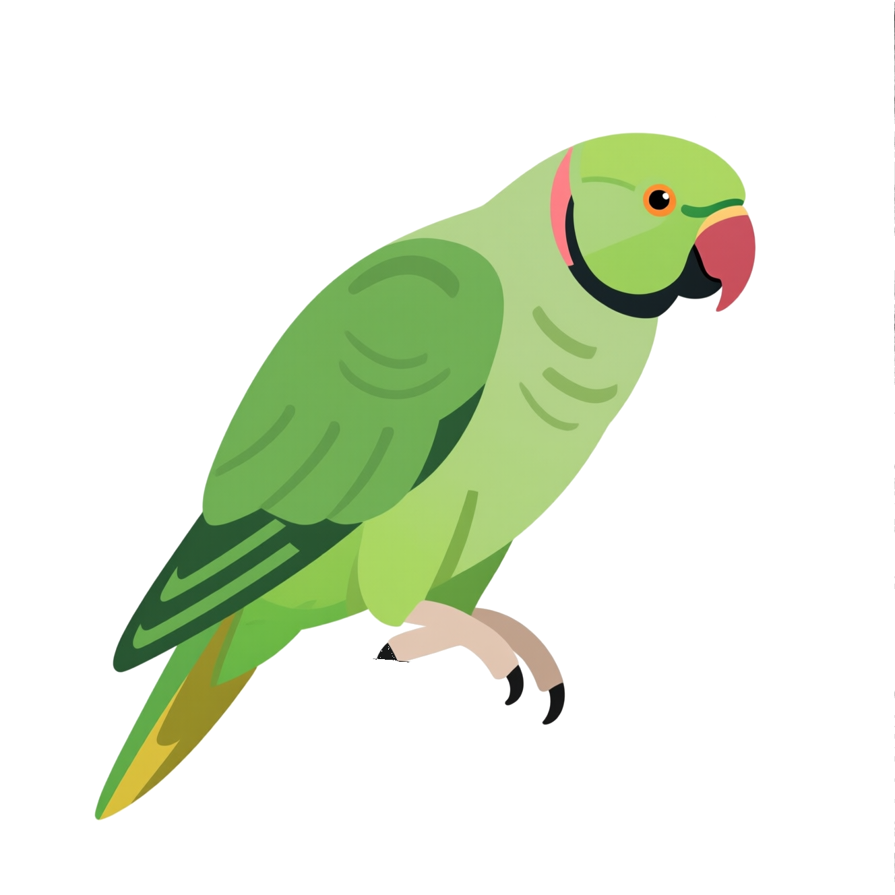

# Vernacula

<p align="center">
  
</p>

<p align="center">
  A .NET 10 speech pipeline library and toolset for local, offline inference using ONNX models.<br/>
  No cloud. No telemetry. Runs entirely on your hardware.
</p>

---

## Parakeet Transcription — Desktop App

**Parakeet Transcription** is a Linux desktop GUI built on this library. It provides a full transcription workflow with speaker diarization, a transcript editor, multi-format export, and automatic model management.

<!-- Screenshots -->
<!-- Add screenshots here once available -->

Features:
- Automatic model download and management
- Speaker diarization (Sortformer or DiariZen)
- Transcript editor with per-segment speaker assignment
- Export to Markdown, plain text, JSON, SRT
- GPU (CUDA) and CPU execution

Built with [Avalonia UI](https://avaloniaui.net/) — runs on any Linux desktop environment.

---

## Library Components

| Project | Description | License |
|---|---|---|
| `Vernacula.Base` | Core inference library — ASR, diarization, VAD, audio utilities | MIT |
| `Vernacula.CLI` | Command-line transcription tool | MIT |
| `Vernacula.Avalonia` | Desktop GUI app for Linux (Parakeet Transcription) | PolyForm Shield 1.0.0 |

Built around the [NVIDIA Parakeet TDT](https://huggingface.co/nvidia/parakeet-tdt-0.6b-v2) ASR model with pluggable backends for each pipeline stage.

## Requirements

- [.NET 10 SDK](https://dotnet.microsoft.com/download/dotnet/10.0)
- FFmpeg libraries (`libavformat`, `libavcodec`, `libavutil`, `libswresample`, `libswscale`)
- **For GPU acceleration:** NVIDIA GPU with CUDA Toolkit installed

Install FFmpeg on common distros:

```bash
# Arch / Manjaro
sudo pacman -S ffmpeg

# Ubuntu / Debian
sudo apt install ffmpeg

# Fedora
sudo dnf install ffmpeg
```

## Models

Models are hosted on HuggingFace and downloaded automatically by the Avalonia app. For CLI use, download them manually:

- **Core models** (ASR + Sortformer diarization + VAD): [christopherthompson81/sortformer_parakeet_onnx](https://huggingface.co/christopherthompson81/sortformer_parakeet_onnx)
- **DiariZen models** (optional, advanced diarization): [christopherthompson81/diarizen_onnx](https://huggingface.co/christopherthompson81/diarizen_onnx)

Download with `huggingface-cli` or `git lfs`:

```bash
# Install huggingface_hub if needed
pip install huggingface_hub

huggingface-cli download christopherthompson81/sortformer_parakeet_onnx --local-dir ~/models/parakeet
```

---

## Building

All projects are built with `dotnet build`. The `EP` property selects the ONNX Runtime execution provider:

| `-p:EP=` | Hardware | Notes |
|---|---|---|
| `Cuda` | NVIDIA GPU | Default. Requires CUDA Toolkit. |
| `Cpu` | Any CPU | No GPU required. Slower. |
| `DirectML` | Windows only | Not supported on Linux. |

### Vernacula.CLI

```bash
cd src/Vernacula.CLI

# GPU (CUDA)
dotnet build -c Release -p:EP=Cuda -p:Platform=x64

# CPU only
dotnet build -c Release -p:EP=Cpu -p:Platform=x64
```

### Vernacula.Avalonia (Linux Desktop)

```bash
cd src/Vernacula.Avalonia

# Build
dotnet build -c Release -p:EP=Cuda -p:Platform=x64

# Or publish as self-contained (recommended for desktop install)
dotnet publish -c Release -p:EP=Cuda -p:Platform=x64 \
  -r linux-x64 --self-contained true \
  -o ~/apps/parakeet
```

---

## CLI Usage

```
Usage: vernacula-cli --audio <file> --model <dir> [options]

Required:
  --audio <path>           Audio file to transcribe
  --model <dir>            Directory containing ONNX model files

Output:
  --output <path>          Output file path (auto-named if omitted)
  --export-format <fmt>    Output format: md (default), txt, json, srt

Diarization:
  --diarization <backend>  Speaker diarization backend:
                             sortformer  NVIDIA Sortformer (default, fast)
                             diarizen    DiariZen clustering (more accurate, slower)
                             vad         Silero VAD only (no speaker identity)
  --segments <path>        Load pre-computed segments JSON, skip diarization
                           Format: [{start, end, speaker}, ...]
  --ahc-threshold <float>  DiariZen AHC clustering threshold (default: 0.6)

Model:
  --precision <fp32|int8>  Model precision (default: fp32)
  --skip-asr               Export diarization segments only, skip transcription

Diagnostics:
  --benchmark              Print timing and real-time factor (RTF) after run
```

### Examples

```bash
# Basic transcription with Sortformer diarization
dotnet run --project src/Vernacula.CLI -p:EP=Cuda -- \
  --audio meeting.wav --model ~/models/parakeet

# SRT output using DiariZen
dotnet run --project src/Vernacula.CLI -p:EP=Cuda -- \
  --audio interview.flac --model ~/models/parakeet \
  --diarization diarizen --export-format srt --output interview.srt

# CPU-only, int8 quantized models
dotnet run --project src/Vernacula.CLI -p:EP=Cpu -- \
  --audio recording.wav --model ~/models/parakeet --precision int8
```

---

## Linux Desktop Installation (Avalonia)

Run the installer from the repo root:

```bash
./install.sh
```

The script publishes a self-contained build, installs the icon, creates a `.desktop` entry, and refreshes the desktop database. The app will appear in your application launcher under Audio/Video.

The default build targets CUDA but falls back to CPU automatically if no NVIDIA GPU is present — no flags needed. Pass `--ep Cpu` only if you want a smaller install without the CUDA runtime libraries.

To install to a custom location:
```bash
./install.sh --prefix /opt/parakeet
```

> **Note:** The first launch opens a model download dialog. Model sizes:
> - Core fp32: ~3 GB (encoder data file is 2.44 GB)
> - Core int8: ~820 MB
> - DiariZen add-on: ~310 MB
>
> Models are stored in `~/.local/share/Parakeet/models/`.

---

## DiariZen Environment Variables

DiariZen's segmentation and embedding pipeline can be tuned via environment variables for your hardware:

| Variable | Description |
|---|---|
| `PARAKEET_DIARIZEN_SEG_THREADS` | Segmentation intra-op thread count |
| `PARAKEET_DIARIZEN_SEG_MAX_WORKERS` | Max parallel segmentation workers |
| `PARAKEET_DIARIZEN_SEG_BATCH_SIZE` | Segmentation batch size |
| `PARAKEET_DIARIZEN_EMBED_THREADS` | Embedding intra-op thread count |
| `PARAKEET_DIARIZEN_EMBED_MAX_WORKERS` | Max parallel embedding workers |
| `PARAKEET_DIARIZEN_EMBED_GPU_SAFETY_MB` | GPU memory safety margin (MB) |
| `PARAKEET_DIARIZEN_EMBED_GPU_MAX_BATCH_SIZE` | Max embedding batch size |
| `PARAKEET_DIARIZEN_EMBED_GPU_MAX_BATCH_FRAMES` | Max frames per embedding batch |

---

## Pipeline Backends

### ASR
- **NVIDIA Parakeet TDT 0.6B** — CTC/Transducer hybrid, English, streaming-friendly

### Diarization
| Backend | Speed | Accuracy | Overlap detection |
|---|---|---|---|
| Sortformer | Fast | Good | Yes (4-speaker max per chunk) |
| DiariZen | Slower | Better | Yes (powerset, 4-speaker max) |
| Silero VAD | Fastest | None (no identity) | No |

### Execution Providers
| EP | Platform | Notes |
|---|---|---|
| CUDA | Linux, Windows | Best performance on NVIDIA GPUs |
| CPU | All | Works everywhere, no GPU needed |
| DirectML | Windows only | AMD/Intel/NVIDIA via DirectX 12 |

---

## Benchmarks

All runs on a 10-minute English audio file, fp32 models, Sortformer diarization.

| Hardware | Diarization | ASR | Total | RTF |
|---|---|---|---|---|
| AMD Ryzen 7 7840U (CPU) | 33.2s | 49.2s | 82.4s | 0.137 |
| NVIDIA RTX 3090 (CUDA) | — | — | — | — |

RTF < 1.0 means faster than real-time. CPU-only inference is already well within real-time on a mid-range laptop CPU.

> RTX 3090 results pending — will update once benchmarked.

---

## License

- `Vernacula.Base` and `Vernacula.CLI` — [MIT](src/Vernacula.Base/LICENSE)
- `Vernacula.Avalonia` — [PolyForm Shield 1.0.0](src/Vernacula.Avalonia/LICENSE) (free to use and build; may not be used to create a competing commercial product)
- Model weights — see respective HuggingFace repository licenses
