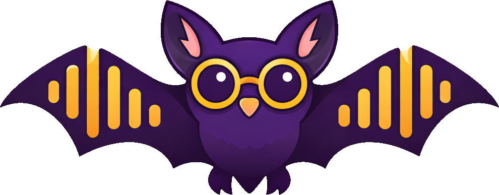
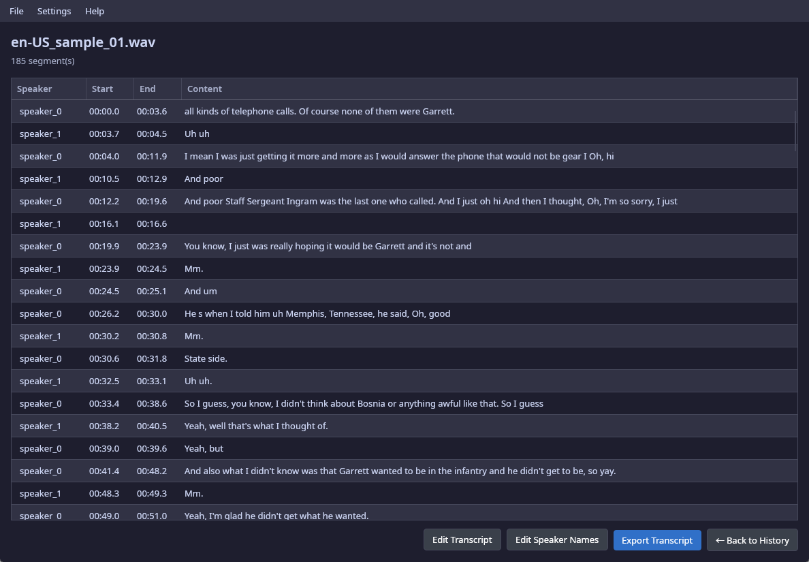

# Vernacula

<p align="center">
  A .NET 10 speech pipeline library and toolset for local, offline inference using ONNX models.<br/>
  No cloud. No telemetry. Runs entirely on your hardware.
</p>

<p align="center">
  
</p>

Vernacula converts audio into accurate, multi-speaker transcripts on your own computer. It ships as a reusable library (`Vernacula.Base`), a command-line tool (`Vernacula.CLI`), and a cross-platform desktop app (`Vernacula-Desktop`, built on Avalonia UI).

Powered by NVIDIA's [Parakeet TDT v3](https://huggingface.co/nvidia/parakeet-tdt-0.6b-v3) and [Sortformer](https://huggingface.co/nvidia/diar_sortformer_4spk-v2.1) by default, with optional pluggable backends (Cohere Transcribe, Qwen3-ASR, VibeVoice-ASR, Granite Speech 4.1). Parakeet v3 posts a **Word Error Rate of 4.85** on Google's FLEURS benchmark. Most modern computers will transcribe one hour of audio in about five minutes; GPU-accelerated systems are significantly faster.

## Demo

https://github.com/user-attachments/assets/42015635-03b9-4c6b-868c-248e8c29c352



More screenshots and a feature tour live in [docs/desktop-app.md](docs/desktop-app.md).

## Highlights

- **Local, private transcription** — audio never leaves your computer
- **Multi-speaker detection** — identifies and labels up to four concurrent speakers
- **No audio length limits** — streaming and segmentation handle indefinite file lengths
- **Transcript editor** with confidence colouring, audio playback, and word-level timestamps
- **Pluggable ASR backends** — Parakeet TDT v3, Cohere Transcribe, Qwen3-ASR, VibeVoice-ASR, Granite Speech 4.1
- **Shallow KenLM fusion** for domain-specific English (general, medical)
- **Export** to XLSX, CSV, JSON, SRT, Markdown, DOCX, and SQLite
- **GPU acceleration** via CUDA (DirectML on Windows), with automatic CPU fallback
- **52 languages** covered across the four backends — see the [support matrix](docs/reference/backends.md#language-support-matrix)

## Model conversion pipelines

Vernacula's models are converted in-house from upstream PyTorch / NeMo / HuggingFace checkpoints into the ONNX contract its C# inference code expects. The export tooling lives in [`scripts/`](scripts/) and is usable independently of the rest of the project — the export scripts are dev-time only and never ship as a runtime dependency.

| Model | Source | Export tooling |
|---|---|---|
| Parakeet TDT v3 / RNNT | [nvidia/parakeet-tdt-0.6b-v3](https://huggingface.co/nvidia/parakeet-tdt-0.6b-v3) | [scripts/nemo_export](scripts/nemo_export) |
| Sortformer streaming diarization | [nvidia/diar_sortformer_4spk-v2.1](https://huggingface.co/nvidia/diar_sortformer_4spk-v2.1) | [scripts/nemo_export](scripts/nemo_export) |
| Silero VAD | [snakers4/silero-vad](https://github.com/snakers4/silero-vad) | [scripts/nemo_export](scripts/nemo_export) |
| Qwen3-ASR | [Qwen/Qwen3-ASR-0.6B](https://huggingface.co/Qwen/Qwen3-ASR-0.6B), [Qwen3-ASR-1.7B](https://huggingface.co/Qwen/Qwen3-ASR-1.7B) | [scripts/qwen3asr_export](scripts/qwen3asr_export) |
| Cohere Transcribe | [CohereLabs/cohere-transcribe-03-2026](https://huggingface.co/CohereLabs/cohere-transcribe-03-2026) | [scripts/cohere_export](scripts/cohere_export) |
| VibeVoice-ASR | [microsoft/VibeVoice-ASR-HF](https://huggingface.co/microsoft/VibeVoice-ASR-HF) | [scripts/vibevoice_export](scripts/vibevoice_export) |
| Granite Speech 4.1 | [ibm-granite/granite-speech-4.1-2b](https://huggingface.co/ibm-granite/granite-speech-4.1-2b) | [scripts/granite_export](scripts/granite_export) |
| OmniVoice (IPA fine-tune, TTS) | [k2-fsa/OmniVoice](https://huggingface.co/k2-fsa/OmniVoice) | [scripts/omnivoice_export](scripts/omnivoice_export), [scripts/omnivoice_ipa](scripts/omnivoice_ipa) |
| DeepFilterNet3 (streaming) | [Rikorose/DeepFilterNet](https://github.com/Rikorose/DeepFilterNet) | [scripts/deepfilternet3_export](scripts/deepfilternet3_export) |
| DiariZen + WeSpeaker | [BUTSpeechFIT/DiariZen](https://github.com/BUTSpeechFIT/DiariZen) | [scripts/diarizen_export](scripts/diarizen_export) |
| VoxLingua107 (language ID) | [speechbrain/lang-id-voxlingua107-ecapa](https://huggingface.co/speechbrain/lang-id-voxlingua107-ecapa) | [scripts/voxlingua107_export](scripts/voxlingua107_export) |

Most of these graphs (split KV-cache decoders, transducer/TDT decoder state, streaming GRU hidden-state I/O, six-input Sortformer chunked diarization) require non-trivial graph surgery beyond `torch.onnx.export` defaults. Each export folder has its own README with the contract, parity checks, and tuning notes.

A KenLM build pipeline for Parakeet shallow fusion lives in [scripts/kenlm_build](scripts/kenlm_build); an in-progress IndicConformer export spike is in [scripts/indicconformer_export](scripts/indicconformer_export).

## Quick start

**Install prerequisites** — [.NET 10 SDK](https://dotnet.microsoft.com/download/dotnet/10.0) plus FFmpeg. Full setup (including GPU) is in [docs/installation.md](docs/installation.md).

**Run the desktop app:**

```bash
cd src/Vernacula.Avalonia
dotnet run
```

On Linux, `./install.sh` from the repo root builds a self-contained package and registers a `.desktop` entry.

**Run the CLI:**

```bash
dotnet run --project src/Vernacula.CLI -p:EP=Cuda -- \
  --audio meeting.wav --model ~/models/vernacula
```

Full argument reference and more examples in [docs/cli-reference.md](docs/cli-reference.md). Build configurations (CUDA / CPU / DirectML) in [docs/building.md](docs/building.md).

## Documentation

Full documentation lives in [`docs/`](docs/).

**Getting started**
- [Installation](docs/installation.md) — .NET 10, FFmpeg, GPU prerequisites, Linux installer
- [Desktop app](docs/desktop-app.md) — features, screenshots, walkthrough
- [CLI reference](docs/cli-reference.md) — invocation, arguments, examples
- [Models](docs/models.md) — required and optional model downloads
- [Building from source](docs/building.md) — build configurations and publish guidance

**Reference**
- [Pipeline backends and language support](docs/reference/backends.md)
- [Language model fusion (KenLM)](docs/reference/language-model-fusion.md)
- [Benchmarks](docs/reference/benchmarks.md)

**Project**
- [Licensing](docs/licensing.md)
- [Developer notes](docs/dev/)

## License

- `Vernacula.Base` and `Vernacula.CLI` — [MIT](src/Vernacula.Base/LICENSE)
- `Vernacula.Avalonia` — [PolyForm Shield 1.0.0](src/Vernacula.Avalonia/LICENSE) (free to use and build; may not be used to create a competing commercial product)
- Model weights — see respective HuggingFace repository licenses

See [docs/licensing.md](docs/licensing.md) for the full breakdown.
