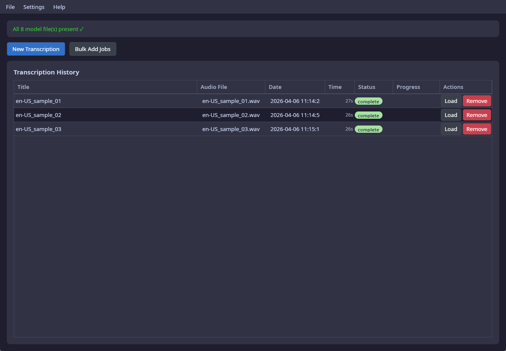
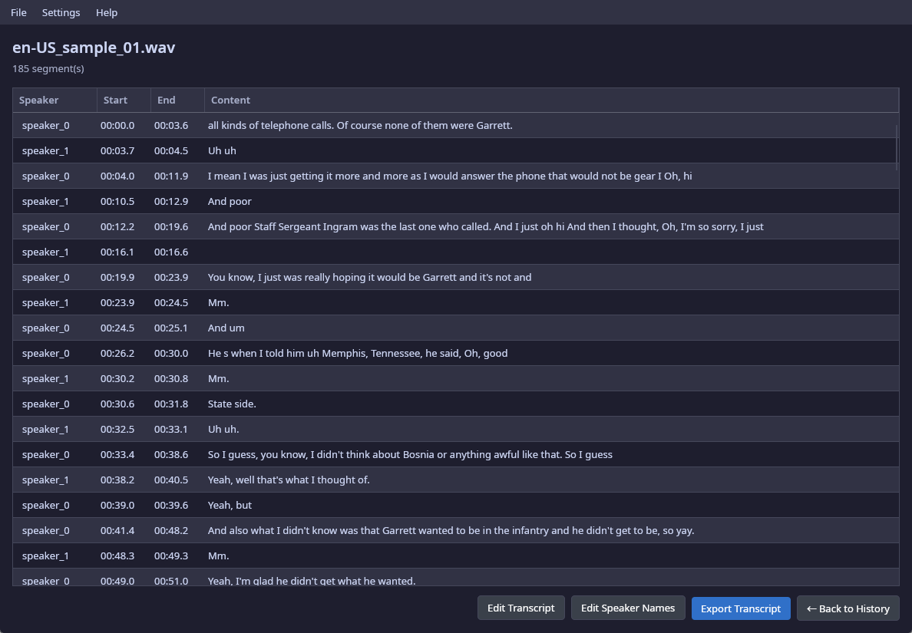
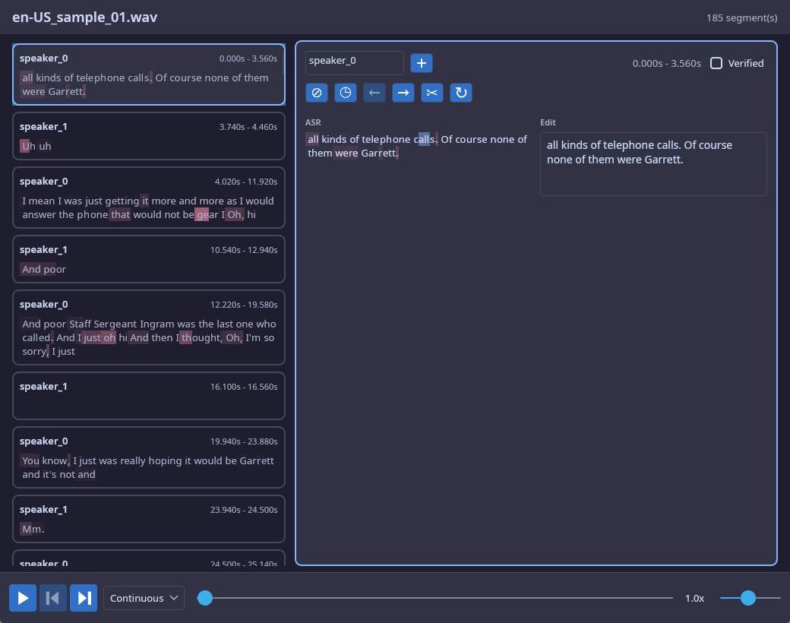

# Vernacula Desktop

Vernacula-Desktop is the Avalonia-based GUI for running the Vernacula pipeline on your own machine. It wraps the full stack — diarization, ASR, optional language identification, and optional KenLM fusion — behind a job queue and transcript editor.

<p align="center">
  
</p>

Vernacula-Desktop converts audio files into accurate, multi-speaker transcripts — entirely on your own computer. No cloud uploads, no subscriptions, no privacy concerns. Works on Linux, Mac, and Windows (Android, iOS, and WebAssembly are untested).

Powered by NVIDIA's [Parakeet TDT v3](https://huggingface.co/nvidia/parakeet-tdt-0.6b-v3) and [Sortformer](https://huggingface.co/nvidia/diar_sortformer_4spk-v2.1) by default, with optional pluggable backends (Cohere Transcribe, Qwen3-ASR, VibeVoice-ASR). Parakeet v3 posts a **Word Error Rate of 4.85** on Google's FLEURS benchmark — among the best available anywhere. Most modern computers will transcribe one hour of audio in about five minutes. GPU-accelerated systems are significantly faster.

## Demo

https://github.com/user-attachments/assets/42015635-03b9-4c6b-868c-248e8c29c352

## Screenshots

**Jobs view** — queue and manage transcription jobs



**Results view** — review the completed transcript with speaker labels and timestamps



**Transcript editor** — correct text, adjust timing, and verify segments with audio playback



## Highlights

- **Local, private transcription** — audio never leaves your computer
- **Multi-speaker detection** — identifies and labels up to four concurrent speakers
- **No audio length limits** — streaming and segmentation handle indefinite file lengths
- **Job queue** — pause and resume long transcription jobs
- **Automatic punctuation and capitalization** from the acoustic model
- **Transcript editor** with confidence colouring, audio playback, word-level highlighting, and segment editing
- **Word-level timestamps** (real TDT duration-head values for Parakeet, synthesized for others)
- **Beam search + shallow KenLM fusion** for Parakeet — opt-in domain biasing via the Settings → Language model dropdown
- **Language identification** (VoxLingua107, optional) with file-level or per-segment modes
- **Wide format support** — common audio formats plus MP4, MOV, MKV, AVI, WMV, FLV, MTS, and more
- **Export** to XLSX, CSV, JSON, SRT, Markdown, DOCX, and SQLite
- **Full analysis data** in SQLite with per-token durations, logprobs, and speaker labels
- **GPU acceleration** via CUDA (DirectML on Windows), with automatic CPU fallback
- **Parakeet v3 covers 25 languages**: English, French, German, Spanish, Portuguese, Italian, Dutch, Polish, Russian, Ukrainian, Czech, Slovak, Romanian, Hungarian, Bulgarian, Croatian, Slovenian, Greek, Swedish, Danish, Finnish, Estonian, Latvian, Lithuanian, and Maltese
- **Qwen3-ASR and Cohere Transcribe backends** add ~30 and ~15 additional language options respectively

Built with [Avalonia UI](https://avaloniaui.net/) — runs on any desktop environment.

## Running from source

```bash
cd src/Vernacula.Avalonia
dotnet run
```

For packaged installs on Linux, see [Installation](installation.md). For custom build configurations, see [Building from source](building.md).

## Models

The Avalonia app surfaces each model repo through Settings → Models and handles downloads, resuming, and hash verification. See [Models](models.md) for the full catalogue.
